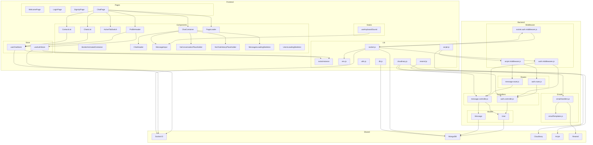

    

    <b>Automatic Architecture Diagrams from Code</b> 
    <a href="https://github.com/swark-io/swark">GitHub</a> • <a href="https://swark.io">Website</a> • <a href="mailto:contact@swark.io">Contact Us</a>

## Usage Instructions

1. **Render the Diagram**: Use the links below to open it in Mermaid Live Editor, or install the [Mermaid Support](https://marketplace.visualstudio.com/items?itemName=bierner.markdown-mermaid) extension.
2. **Recommended Model**: If available for you, use `claude-3.5-sonnet` [language model](vscode://settings/swark.languageModel). It can process more files and generates better diagrams.
3. **Iterate for Best Results**: Language models are non-deterministic. Generate the diagram multiple times and choose the best result.

## Generated Content
**Model**: GPT-4o - [Change Model](vscode://settings/swark.languageModel)  
**Mermaid Live Editor**: [View](https://mermaid.live/view#pako:eNp9VttuozAQ_ZUIad_afkAeVjKQCwm5kjRtnT444Aa3YEfYtBtV_fe1TcEmpH3KmTPjMxcPVj6dmCXY6Tt7eizQKe1t_D3t9Xh5qMxhwajANFGkRXssPzGKqeCVo9cD0GVFggtASY4ETjx5DhGKi-c6woVeikSX9zQ_xiixSB_OMOfoiAN6KkVDD-CcSYV3XHAkCKPLDMU4ZZl9dKhilCLhghXnayGjWp2HDCWEHqM3nGHBaBMxhsuCvZAMX9QVQBAL8o436BB9EBGnjWei2-ChzNpwU6jbjUWLDeGWywZ-Sj2DS1mZ8jZ5uxegQprZz-EOZzHLsWIbnQUM2ZHQFreEETnS7alFrnTlFtVNF8lJ4jp-DUuOQSlSzTYykaKVkk13pcaMvTWVb9SZKT4fGCqSiJU0-fFcSA71qS1E_wjjAeUC0fgilf5p7bCL4reu3pqVwozwHiLZ0F2hyLtX3jS1g3m1KZeua98EFQXLMnm19emHSjVuPLb0YyN9zd_Vn8kPNWukn_QSNWIA1Cv983mSJBn-QOYigVvVlzcebhcIPMiZHJ24u4hqBfkQFfGrDLrm__UawQBi-t4SG8Lk0CJGdQk2OYalIFm71gDGGSvlB4WKc8sxqeuzySmUvcrifqt0kCNi5g1CiBUxRjRRV9ySm1W-Dc5PmXz8eEe2u5RRKgf1nRLMYVR1GSy-z4EFnDF6ZL5bE0voNQ3W3AoC3Vttr-Fat_Xcyvnnj9pNimP1YuqG1r3b27-9rYKRgRsN9fu_0tA1cGLg1MDAwLGBMwVdDT0DfQMHBg4NHCk41nBtYKTgxMCpgVUXYG7aqPC9xg8K7jR8VPBBwycFHy8hAAo_VXihMAC24RrFb6wlgVcF6cqBr417C-80Hlml1YZnG65tLGxDDwoMbU9gpQ-ssioMltqo5gV821hpoxofCLURVsbMNuTonRsnx4Vc6ET-L_jcOyLFOd47_d7eSfALKjOxd75kUHlK5LL7BMmNzp2-KEp848ingkVnGte2fDaPqdN_QRnHX_8BZuqI6A) | [Edit](https://mermaid.live/edit#pako:eNp9VttuozAQ_ZUIad_afkAeVjKQCwm5kjRtnT444Aa3YEfYtBtV_fe1TcEmpH3KmTPjMxcPVj6dmCXY6Tt7eizQKe1t_D3t9Xh5qMxhwajANFGkRXssPzGKqeCVo9cD0GVFggtASY4ETjx5DhGKi-c6woVeikSX9zQ_xiixSB_OMOfoiAN6KkVDD-CcSYV3XHAkCKPLDMU4ZZl9dKhilCLhghXnayGjWp2HDCWEHqM3nGHBaBMxhsuCvZAMX9QVQBAL8o436BB9EBGnjWei2-ChzNpwU6jbjUWLDeGWywZ-Sj2DS1mZ8jZ5uxegQprZz-EOZzHLsWIbnQUM2ZHQFreEETnS7alFrnTlFtVNF8lJ4jp-DUuOQSlSzTYykaKVkk13pcaMvTWVb9SZKT4fGCqSiJU0-fFcSA71qS1E_wjjAeUC0fgilf5p7bCL4reu3pqVwozwHiLZ0F2hyLtX3jS1g3m1KZeua98EFQXLMnm19emHSjVuPLb0YyN9zd_Vn8kPNWukn_QSNWIA1Cv983mSJBn-QOYigVvVlzcebhcIPMiZHJ24u4hqBfkQFfGrDLrm__UawQBi-t4SG8Lk0CJGdQk2OYalIFm71gDGGSvlB4WKc8sxqeuzySmUvcrifqt0kCNi5g1CiBUxRjRRV9ySm1W-Dc5PmXz8eEe2u5RRKgf1nRLMYVR1GSy-z4EFnDF6ZL5bE0voNQ3W3AoC3Vttr-Fat_Xcyvnnj9pNimP1YuqG1r3b27-9rYKRgRsN9fu_0tA1cGLg1MDAwLGBMwVdDT0DfQMHBg4NHCk41nBtYKTgxMCpgVUXYG7aqPC9xg8K7jR8VPBBwycFHy8hAAo_VXihMAC24RrFb6wlgVcF6cqBr417C-80Hlml1YZnG65tLGxDDwoMbU9gpQ-ssioMltqo5gV821hpoxofCLURVsbMNuTonRsnx4Vc6ET-L_jcOyLFOd47_d7eSfALKjOxd75kUHlK5LL7BMmNzp2-KEp848ingkVnGte2fDaPqdN_QRnHX_8BZuqI6A)

